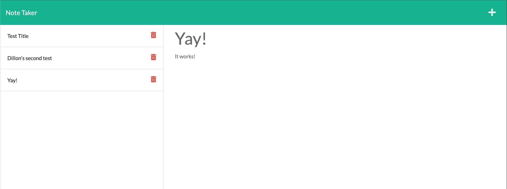

# Note Taker
Boot Camp HW # 9

## Project Description
- This is a note taking application that uses an Express server as the backend.
- User is able to create and store notes locally in the browser by clicking on the "+" in the top right of the application.
- User can then start typing a note title and add note text too. Once the note has both title text and note body text a save icon will appear in the top right of the browser window. Clicking on the save button will add the note to the list on the left hand side of the application.

## Screenshot

## Website Link (Heroku Application)
https://cleadi-note-taker-app.herokuapp.com/